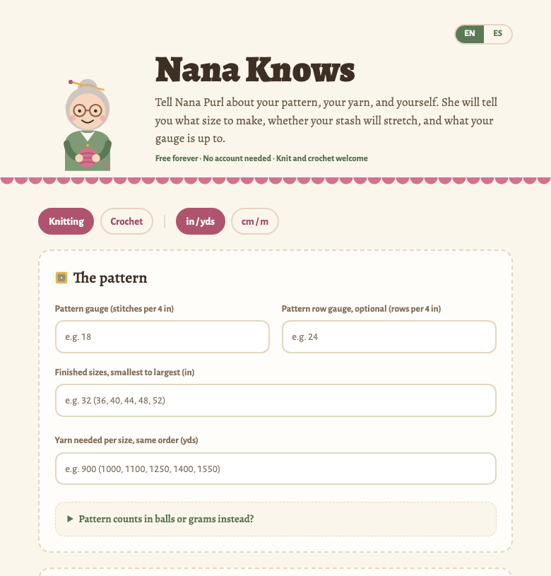
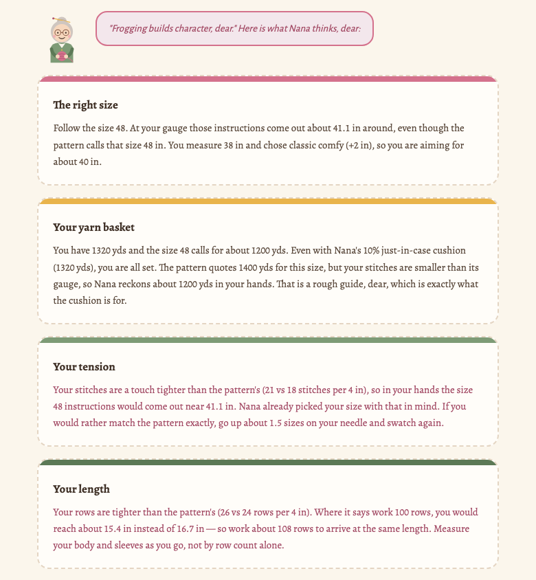
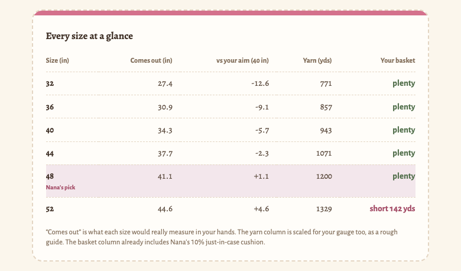

# Nana Knows 👵 🧶

**Ask her at [rachelselbrede.github.io/nana-knows](https://rachelselbrede.github.io/nana-knows/)** · [en español](https://rachelselbrede.github.io/nana-knows/?lang=es)

Tell Nana Purl about your pattern, your yarn, and yourself. She tells you what
size to make, whether your stash will stretch, and what your gauge is up to.

Free forever. No account. Nothing collected. Knit and crochet both welcome.



## What she does

- **Recommends which pattern size to make** from your body measurement plus the
  ease you like — and if you give her your own swatch gauge, she first works out
  what each size would *really* measure in your hands, and picks from that.
- **Lays every size on the table.** One ask, and each size the pattern offers
  is compared side by side: what it would really measure in your hands, how
  far that lands from your aim, the yarn it calls for, and whether your basket
  covers it — with Nana's pick marked. Handy when you land between sizes, or
  the stash is what it is.
- **Checks whether the yarn in your basket covers it**, with a 10% just-in-case
  cushion, because running out at the second sleeve is heartbreak.
- **Checks row gauge too**, so you know whether the pattern's row counts will
  land at the length it intended, and how many rows to work instead if not.
- **Turns a counted swatch into a gauge.** "22 stitches across 4¼ inches" is
  not the number a pattern quotes; tell Nana what you counted and how wide it
  stretched, and she hands you the per-4-inch (or per-10-cm) figure. Rows too.
- **Reads numbers the way knitters write them.** `91,5`, `1,100`, `36 1/2`,
  `32-36`, `36½` — and she echoes back what she read, so a wrong guess is
  visible instead of silently changing the advice.
- **Speaks English and Spanish**, switchable at any moment — advice already on
  screen re-words itself. La abuela también teje.
- **Shares as a link.** Every field rides in the URL itself, so you can send
  Nana's answer to a friend or bookmark a project without any server seeing it.
- **Goes in the project bag**: print just the advice, or copy it as text for
  your Ravelry notes.
- **Remembers you if you ask** — "Nana, remember my numbers" saves your details
  in your own browser (localStorage) and nowhere else.
- **Installs as an app** and works offline, for yarn shops with no signal.





## Run her locally

```bash
npm install
npm run dev
```

Then open the local address Vite prints (usually http://localhost:5173).

```bash
npm test
```

runs the arithmetic suite — 175 tests on Node's built-in runner, no test
dependencies at all. Everything Nana computes is pure functions in `src/lib/`.

## Deploying

Pushing to the `main` branch triggers `.github/workflows/deploy.yml`, which runs
the tests, builds the site, and publishes it to GitHub Pages. A failing suite
blocks the deploy.

One-time setup in the GitHub repo: Settings → Pages → set Source to "GitHub Actions".

Note: `base` in `vite.config.js` is set to `/nana-knows/` and must match the
repo name. If you later use a custom domain, change `base` to `/`.

## Someday

Ideas worth doing, not built yet. Nothing here is promised, and none of it
should break the "no backend, nothing collected" rule.

- **Multiple saved projects** — "remember my numbers" currently holds one set.
  Saving several named projects (still in localStorage) would let someone keep
  a sweater and a blanket going at once.
- **Grams as well as yards** — many European ball bands lead with weight.

Got another idea? Open an issue: "Tell Nana what to learn next" in the footer.

## Privacy

Nana collects nothing. There is no backend, no analytics, and no cookies. Saved
numbers live only in the visitor's own browser, and a shared link carries its
numbers in the link itself.

## License

[MIT](LICENSE). Free forever, in the legal sense too.

Made with love and leftover yarn.
